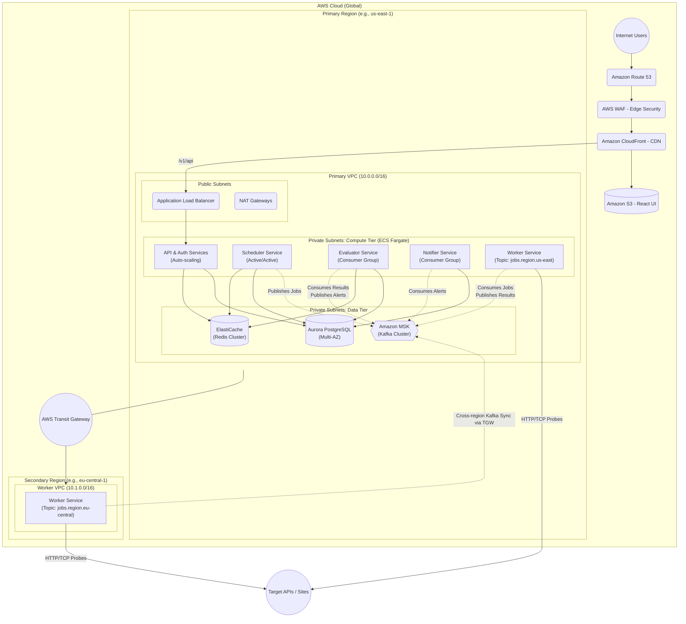

```mermaid
flowchart TB
    %% External Entities
    Users((Internet Users))
    Target((Target APIs / Sites))

    %% AWS Cloud Environment
    subgraph AWS Cloud ["AWS Cloud (Global)"]
        R53(Amazon Route 53)
        WAF(AWS WAF - Edge Security)
        CF(Amazon CloudFront - CDN)
        S3[(Amazon S3 - React UI)]

        Users --> R53
        R53 --> WAF
        WAF --> CF
        CF --> S3
        CF -- "/v1/api" --> ALB

        %% Primary Region
        subgraph Region_Primary ["Primary Region (e.g., us-east-1)"]
            subgraph VPC_Primary ["Primary VPC (10.0.0.0/16)"]
                
                subgraph Public_Subnet ["Public Subnets"]
                    ALB(Application Load Balancer)
                    NAT(NAT Gateways)
                end

                subgraph App_Subnet ["Private Subnets: Compute Tier (ECS Fargate)"]
                    API["API & Auth Services\n(Auto-scaling)"]
                    SCHED["Scheduler Service\n(Active/Active)"]
                    EVAL["Evaluator Service\n(Consumer Group)"]
                    NOTIF["Notifier Service\n(Consumer Group)"]
                    WORK_US["Worker Service\n(Topic: jobs.region.us-east)"]
                end

                subgraph Data_Subnet ["Private Subnets: Data Tier"]
                    MSK{{"Amazon MSK\n(Kafka Cluster)"}}
                    REDIS[("ElastiCache\n(Redis Cluster)")]
                    RDS[("Aurora PostgreSQL\n(Multi-AZ)")]
                end
            end
        end

        %% Edge / Secondary Worker Regions for Global Probing
        subgraph Region_Secondary ["Secondary Region (e.g., eu-central-1)"]
            subgraph VPC_Secondary ["Worker VPC (10.1.0.0/16)"]
                WORK_EU["Worker Service\n(Topic: jobs.region.eu-central)"]
            end
        end
        
        %% Networking Transit
        TGW((AWS Transit Gateway))
    end

    %% Network Routing & Dependencies
    ALB --> API
    API --> REDIS
    API --> RDS

    SCHED --> REDIS
    SCHED --> RDS
    SCHED -. "Publishes Jobs" .-> MSK

    EVAL -. "Consumes Results\nPublishes Alerts" .-> MSK
    EVAL --> REDIS
    EVAL --> RDS

    NOTIF -. "Consumes Alerts" .-> MSK
    NOTIF --> RDS

    %% Workers Probing and Reporting
    WORK_US -. "Consumes Jobs\nPublishes Results" .-> MSK
    WORK_US -- "HTTP/TCP Probes" --> Target

    %% Cross-Region Worker Connection
    VPC_Primary <--- TGW ---> VPC_Secondary
    WORK_EU -. "Cross-region Kafka Sync via TGW" .-> MSK
    WORK_EU -- "HTTP/TCP Probes" --> Target
```
