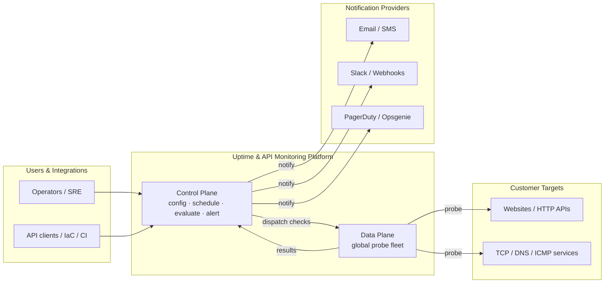
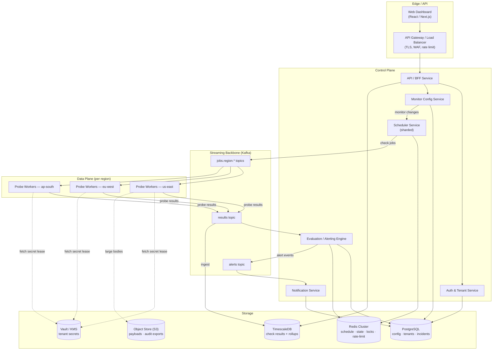
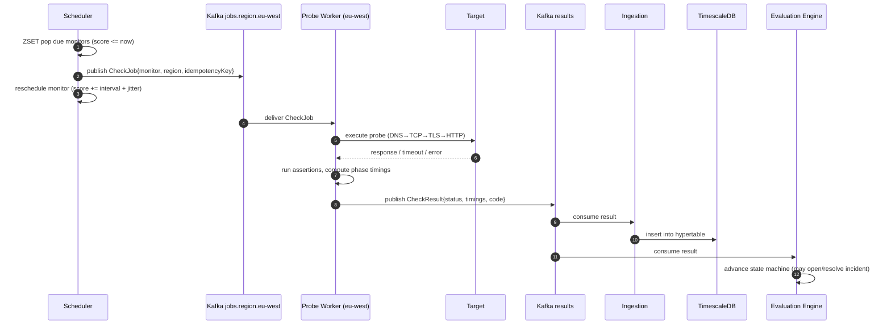
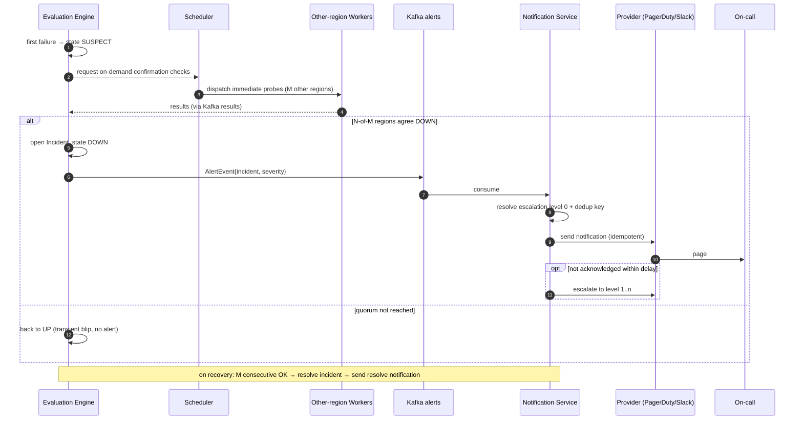
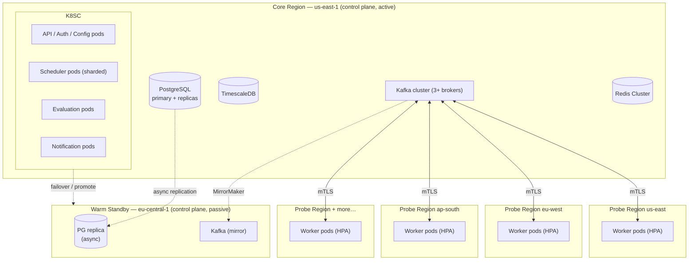
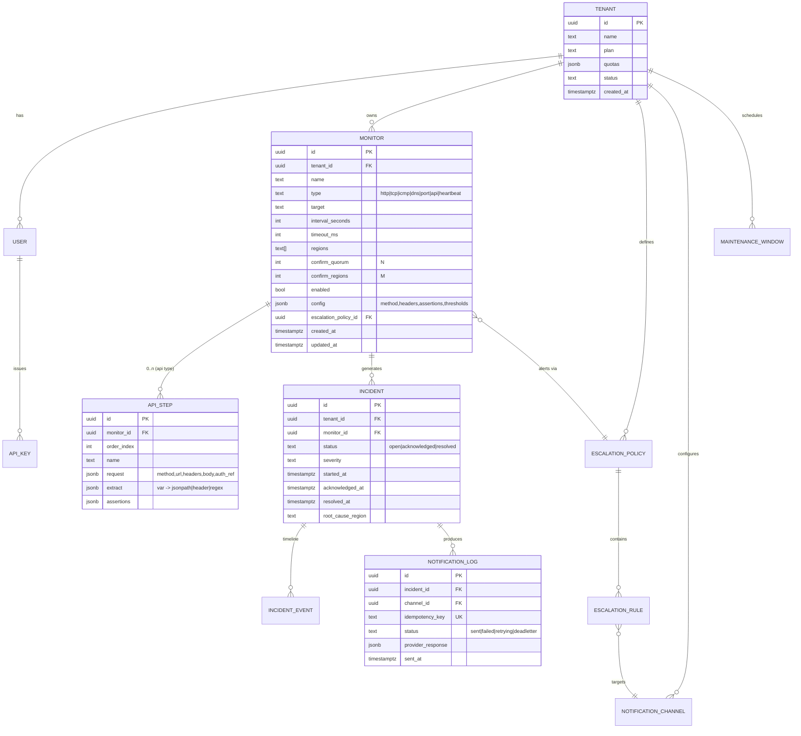
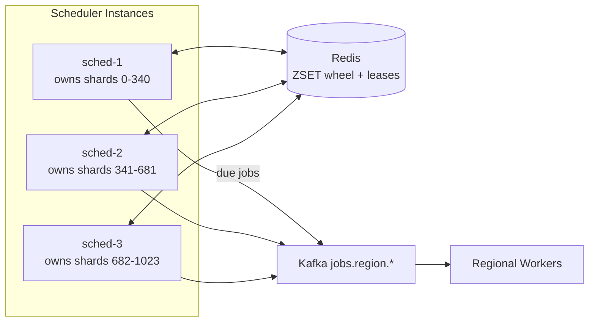
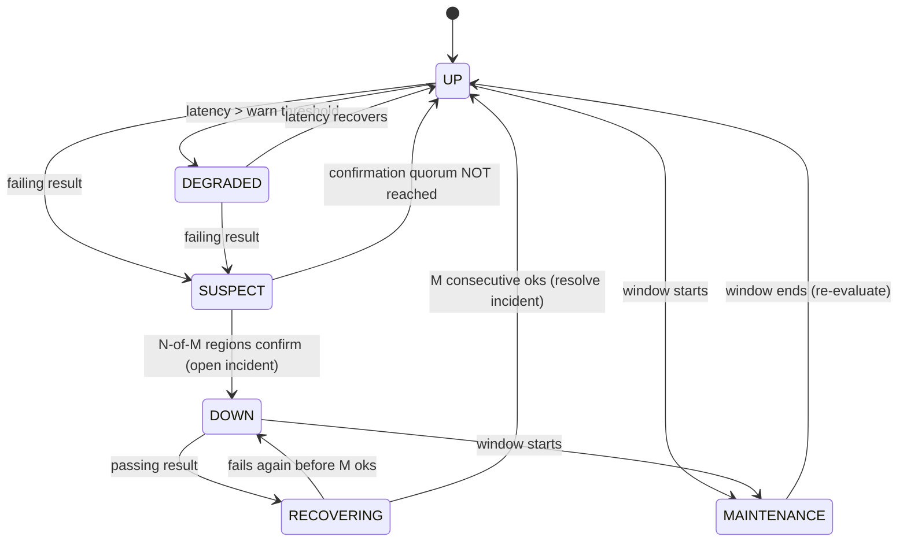
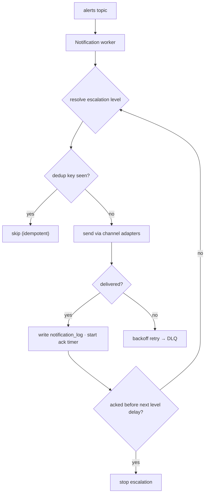

# Uptime Engine & API Monitoring Platform — Architecture

**Document type:** High-Level Design (HLD) + Low-Level Design (LLD)
**Target profile:** Mid-scale, multi-tenant SaaS — tens of thousands of monitors, multi-region probing, 10–60s check intervals
**Primary stack:** Node.js 20+ / TypeScript
**Scope:** Core uptime checks (HTTP/S, TCP, ICMP, DNS, port), API monitoring (multi-step flows, chaining, assertions), Alerting & on-call (email, SMS, Slack, webhooks, PagerDuty/Opsgenie, escalation)
**Status:** v1.0 — design baseline

> Diagrams are written in **Mermaid**. They render on GitHub, GitLab, VS Code (Markdown Preview Mermaid), Obsidian, and most modern Markdown viewers.

---

## Table of Contents

1. [Overview](#1-overview)
2. [Requirements](#2-requirements)
3. [Design Goals, Principles & Non-Goals](#3-design-goals-principles--non-goals)
4. [High-Level Architecture](#4-high-level-architecture)
5. [Core Design Decisions & Trade-offs](#5-core-design-decisions--trade-offs)
6. [Low-Level Design](#6-low-level-design)
7. [Cross-Cutting Concerns](#7-cross-cutting-concerns)
8. [Deployment & Infrastructure](#8-deployment--infrastructure)
9. [Technology Stack Summary](#9-technology-stack-summary)
10. [Capacity Planning](#10-capacity-planning)
11. [Failure Modes & Resilience](#11-failure-modes--resilience)
12. [Phased Roadmap & Future Extensions](#12-phased-roadmap--future-extensions)

---

## 1. Overview

This platform continuously verifies that customer-defined endpoints and API workflows are reachable, correct, and fast — from multiple geographic vantage points — and notifies the right people through the right channel when something breaks, then again when it recovers.

Conceptually the system is split into two planes, a pattern borrowed from network and cloud infrastructure design:

- **Control plane** — the "brain." Owns configuration, tenancy, scheduling decisions, state evaluation, incident lifecycle, and notifications. Runs in a small number of core regions.
- **Data plane** — the "muscle." A stateless fleet of **probe workers** distributed across many regions that actually execute checks against customer targets and emit results. Scales horizontally and independently of the control plane.

The two planes communicate exclusively through durable, replayable message streams. This decoupling is the single most important structural decision in the design: it lets the probing fleet scale, fail, and be deployed to new regions without touching the brain, and it lets the brain be upgraded without dropping in-flight checks.



### 1.1 What "good" looks like

A monitoring product lives or dies by three properties, in priority order:

1. **Trustworthiness** — it must be *more available than the things it watches*, and it must not cry wolf. A false "down" alert at 3 a.m. erodes trust faster than almost anything else. Multi-region confirmation and flap damping exist to protect this.
2. **Timeliness** — detection latency (target: **< 60s** from failure to confirmed incident) and notification latency (target: **< 30s** from confirmed incident to first page).
3. **Accuracy of measurement** — response-time percentiles and status must reflect what a real user in that region would experience, including DNS, TCP, TLS, and time-to-first-byte breakdowns.

---

## 2. Requirements

### 2.1 Functional Requirements

**Monitoring**

- Create/read/update/delete monitors of types: `HTTP(S)`, `TCP`, `ICMP` (ping), `DNS`, `PORT`.
- Per-monitor configuration: target, method/headers/body (HTTP), interval (10s–24h), timeout, request/response assertions, and the set of **regions** to probe from.
- **API monitoring**: ordered multi-step workflows with request chaining — extract values from one step's response (JSON path, header, regex) and inject into later steps; per-step and end-to-end assertions and latency SLAs; authenticated requests using stored secrets.
- Per-region and aggregated results: status, status code, and phase timings (DNS, TCP connect, TLS handshake, TTFB, total).

**Alerting & on-call**

- Alert policies with **multi-region confirmation** (declare "down" only after N-of-M regions agree, or after K consecutive failures).
- **Escalation policies**: ordered levels with delays; auto-escalate if unacknowledged.
- Channels: email, SMS, Slack, generic webhook, PagerDuty, Opsgenie.
- Acknowledge / resolve; auto-resolve on recovery; **maintenance windows** to suppress alerts; **flapping** detection and dampening; notification **deduplication**.

**Platform**

- Multi-tenancy with organizations, users, RBAC, API keys/tokens.
- Dashboards: current status, uptime %, latency percentiles, incident history.
- Public REST API (everything the UI can do), webhooks out, and an audit log.
- Plan-based quotas (monitor count, minimum interval, retention, seats).

### 2.2 Non-Functional Requirements

| Attribute | Target |
|---|---|
| **Scale** | 50,000 active monitors; ~2,500–5,000 probe executions/sec sustained, 10k/sec peak |
| **Control-plane availability** | 99.95% (must exceed monitored systems) |
| **Detection latency** | p95 < 60s from real failure to confirmed incident |
| **Notification latency** | p95 < 30s from confirmed incident to first notification |
| **Measurement accuracy** | Phase-level timings; probe clock skew < 250 ms (NTP) |
| **Durability** | Zero acknowledged-result loss; results are replayable |
| **Data retention** | Raw 30–90d (plan-based); rollups 13 months |
| **Multi-region** | ≥ 6 probing regions at launch; add a region with no control-plane change |
| **Tenant isolation** | Logical isolation by default; optional dedicated probe pools (enterprise) |
| **Security/compliance** | SOC 2-ready controls, encryption in transit + at rest, SSRF-safe probing |

---

## 3. Design Goals, Principles & Non-Goals

### 3.1 Guiding principles

- **The watcher must outlive the watched.** Every component has an HA story; the platform meta-monitors itself and has an *independent, out-of-band* dead-man's switch (§7.3, §11).
- **Decouple planes with durable streams.** Control plane and probe fleet never call each other synchronously on the hot path; they exchange events through Kafka.
- **Stateless where possible, sharded where not.** Probe workers, API pods, and notification workers are stateless and horizontally scalable. The only stateful "ownership" is the scheduler's shard assignment (§6.3).
- **Idempotency everywhere.** Check jobs, result writes, and notifications all carry idempotency keys so at-least-once delivery never causes duplicate side effects.
- **Prefer boring, proven components.** PostgreSQL, Redis, Kafka, Kubernetes. Introduce specialized stores (e.g., ClickHouse) only when a measured limit is hit.
- **Design for false-positive avoidance first.** Confirmation, quorum, and dampening are first-class, not afterthoughts.

### 3.2 Non-goals (v1)

- Public status pages and SSL/domain-expiry monitoring (deferred — see §12; the architecture leaves clean seams for them).
- Synthetic **browser** (headless Chromium) checks — the probe interface anticipates them but v1 ships protocol-level checks only.
- Log/APM ingestion or full observability suite — this is an *external* monitor, not an APM.
- On-prem single-tenant installers.

---

## 4. High-Level Architecture

### 4.1 Component overview



### 4.2 Subsystem responsibilities

| Subsystem | Responsibility | Plane | State |
|---|---|---|---|
| **API / BFF** | Public REST + UI backend; authN/Z; validation; reads TSDB for charts | Control | Stateless |
| **Auth & Tenant** | Orgs, users, RBAC, API keys, OIDC/SSO, quotas | Control | Postgres |
| **Monitor Config** | CRUD of monitors, workflows, policies, channels; emits config-change events | Control | Postgres |
| **Scheduler** | Decides *what* runs *when* and *where*; dispatches jobs | Control | Redis (sharded) |
| **Probe Workers** | Execute checks; measure phase timings; run assertions; emit results | **Data** | Stateless |
| **Evaluation / Alerting** | Per-monitor state machine; confirmation quorum; incident lifecycle; flap/maintenance | Control | Postgres + Redis |
| **Notification** | Resolve escalation → channels; deliver with retries/idempotency | Control | Postgres |
| **Streaming (Kafka)** | Durable, replayable transport between planes | Backbone | Kafka |
| **Storage** | Postgres (config/incidents), TimescaleDB (results), Redis (hot state), S3, Vault | — | Stateful |

### 4.3 Data flow — check lifecycle (happy path)



### 4.4 Data flow — alert lifecycle



### 4.5 Deployment topology (multi-region)



**Topology notes.** The control plane runs active in one core region with a warm standby (async Postgres replication + Kafka mirroring) for regional-disaster failover; RPO ≈ seconds, RTO ≈ minutes via promotion. Probe workers live in many lightweight regional clusters, are fully stateless, autoscale on queue depth, and connect back to the core Kafka over mTLS. **Adding a probe region = deploy a worker Helm release + create its `jobs.region.<name>` topic. No control-plane code change.**

---

## 5. Core Design Decisions & Trade-offs

Each decision below records the **choice**, the **alternatives**, and **why** — so future maintainers can revisit them when constraints change.

### 5.1 Scheduling model — timer-wheel in Redis + durable dispatch

**Choice:** A **Redis sorted-set (ZSET) timer wheel** computes which monitors are *due*; a dispatcher publishes jobs to **Kafka per-region topics**; stateless workers consume.

- **Alternative A — one OS timer per monitor** (e.g., `setTimeout` per monitor in a process): simple, but 50k timers per process is fragile, doesn't survive restarts, and can't be sharded cleanly. Rejected.
- **Alternative B — cron-style relational polling** (`SELECT … WHERE next_run <= now()`): easy but hammers Postgres, has coarse granularity, and contends under load. Rejected as the hot path (kept only as a cold reconciliation sweep).
- **Alternative C — BullMQ delayed jobs** (Redis): great DX, but a single delayed-job ZSET per queue and its polling become a bottleneck near thousands/sec, and it couples scheduling to the worker transport. Used conceptually; we implement the ZSET directly and dispatch through Kafka for regional fan-out and durability.

**Why the winner:** `ZADD`/`ZRANGEBYSCORE`/atomic `ZPOPMIN` (via Lua) give O(log N) due-computation at second granularity, survive restarts (Redis persistence + Postgres source of truth), shard trivially by monitor-ID hash, and separate *"what is due"* (Redis) from *"who runs it"* (Kafka + workers). Trade-off: Redis becomes a critical dependency → mitigated with Redis Cluster + AOF and the ability to rebuild the wheel from Postgres.

### 5.2 Control ↔ data transport — Kafka

**Choice:** Kafka as the streaming backbone for **jobs**, **results**, and **alerts**.

- **Alternatives:** RabbitMQ (great routing, weaker replay/retention at volume), NATS JetStream (very low latency, lighter ops, smaller ecosystem), cloud SQS/PubSub (managed, but replay/ordering semantics vary).
- **Why Kafka:** durability + **replayability** (reprocess results after an evaluation bug), high throughput, partition-per-region ordering, mature Node client (`kafkajs`), and consumer-group horizontal scaling. Trade-off: heavier to operate than NATS → acceptable at this scale; NATS remains a valid substitute for job dispatch if sub-100ms dispatch latency becomes a goal.

### 5.3 Time-series storage — TimescaleDB (with a documented exit to ClickHouse)

**Choice:** **TimescaleDB** (PostgreSQL extension) for `check_results`, using hypertables, compression, and **continuous aggregates** for rollups.

- **Alternatives:** ClickHouse (best-in-class analytical scale, but another system to run and weaker single-row update semantics), InfluxDB (purpose-built, but clustering is a paid tier), VictoriaMetrics (excellent for Prometheus-style metrics, less ideal for wide event rows with strings).
- **Why Timescale:** we already run Postgres, so ops/backups/skills are shared; SQL joins between results and config are trivial; native retention + rollup jobs. Trade-off: a single Postgres-family engine will eventually cap out — the schema and query layer are kept engine-neutral so migrating `check_results` to **ClickHouse** at 10× scale is a contained change (§12, Phase 3).

### 5.4 False-positive avoidance — quorum + on-demand confirmation

**Choice:** A monitor is declared **DOWN** only when a **quorum** of regions agree (default **N-of-M**, e.g., 2 of 3) *or* after **K consecutive** same-region failures for single-region monitors. On the first failure, the evaluation engine triggers **immediate out-of-cycle confirmation probes** from other regions rather than waiting a full interval.

- **Why:** the top complaint about monitoring tools is false alarms from transient network blips between one probe and one target. Cross-region quorum distinguishes "the target is down" from "one probe's path is flaky." Trade-off: slightly higher detection latency and probe cost for a large reduction in false pages — the right trade for trust.

### 5.5 Service granularity — a modular monolith-of-services, not nanoservices

**Choice:** ~6 deployable services (API, Auth/Tenant, Config, Scheduler, Evaluation, Notification) plus the worker, in a **TypeScript monorepo** (pnpm workspaces + shared packages for domain types, Kafka schemas, DB access).

- **Why:** enough separation to scale and fail independently along real axes (probing vs. brain vs. delivery), without the operational tax of dozens of tiny services. Shared contract packages prevent schema drift. Trade-off: services share a repo and release cadence early on; they can be split out later since boundaries are already clean.

### 5.6 Push vs. pull probing

**Choice:** **Pull/active** probing (the platform initiates checks). A **push/heartbeat** ("dead-man's switch") mode is offered as a complementary monitor type for cron jobs and batch tasks — the customer's job pings a URL on a schedule and we alert if the ping is *late*. Both share the same evaluation and alerting spine.

---

## 6. Low-Level Design

### 6.1 Service breakdown

Each service below lists its **responsibility**, **key tech**, **data owned**, and **scaling axis**.

**API / BFF Service**
- *Responsibility:* the only public entry point. Terminates auth, validates payloads (zod), enforces quotas/rate limits, serves the dashboard's aggregated reads (joins config + rollups).
- *Tech:* Fastify (high throughput, low overhead) + zod + OpenAPI generation.
- *Owns:* nothing durable (reads others' stores through their client packages or gRPC).
- *Scales:* stateless, HPA on CPU/RPS.

**Auth & Tenant Service**
- *Responsibility:* organizations, users, roles (Owner/Admin/Editor/Viewer/Responder), API keys (hashed), OIDC/SSO, plan & quota resolution, audit log.
- *Tech:* NestJS, Passport/OIDC, argon2id for key/secret hashing.
- *Owns:* `tenants`, `users`, `memberships`, `api_keys`, `audit_log`.
- *Scales:* stateless; token introspection cached in Redis.

**Monitor Config Service**
- *Responsibility:* CRUD for monitors, API workflows, alert/escalation policies, notification channels, maintenance windows. Validates targets (SSRF policy, §7.1). Emits `monitor.changed` events so the scheduler updates the wheel.
- *Tech:* NestJS + Prisma (Postgres).
- *Owns:* `monitors`, `api_steps`, `alert_policies`, `escalation_policies`, `notification_channels`, `maintenance_windows`.
- *Scales:* stateless.

**Scheduler Service** — see §6.3.
**Evaluation / Alerting Engine** — see §6.5.
**Notification Service** — see §6.6.

**Probe Worker** — see §6.4.

### 6.2 Data model

#### 6.2.1 Entity relationships (control plane — PostgreSQL)



#### 6.2.2 Key Postgres DDL (abbreviated)

```sql
CREATE TABLE monitors (
  id                   UUID PRIMARY KEY DEFAULT gen_random_uuid(),
  tenant_id            UUID NOT NULL REFERENCES tenants(id),
  name                 TEXT NOT NULL,
  type                 TEXT NOT NULL CHECK (type IN
                         ('http','tcp','icmp','dns','port','api','heartbeat')),
  target               TEXT NOT NULL,
  interval_seconds     INT  NOT NULL CHECK (interval_seconds BETWEEN 10 AND 86400),
  timeout_ms           INT  NOT NULL DEFAULT 10000,
  regions              TEXT[] NOT NULL,
  confirm_quorum       INT NOT NULL DEFAULT 2,   -- N
  confirm_regions      INT NOT NULL DEFAULT 3,   -- M
  enabled              BOOLEAN NOT NULL DEFAULT TRUE,
  config               JSONB NOT NULL DEFAULT '{}',
  escalation_policy_id UUID REFERENCES escalation_policies(id),
  created_at           TIMESTAMPTZ NOT NULL DEFAULT now(),
  updated_at           TIMESTAMPTZ NOT NULL DEFAULT now()
);
CREATE INDEX ON monitors (tenant_id) WHERE enabled;      -- tenant scoping
CREATE INDEX ON monitors USING GIN (config);

-- Row-Level Security enforces tenant isolation at the engine (§7.2)
ALTER TABLE monitors ENABLE ROW LEVEL SECURITY;
CREATE POLICY tenant_isolation ON monitors
  USING (tenant_id = current_setting('app.tenant_id')::uuid);
```

#### 6.2.3 Time-series schema (TimescaleDB)

```sql
CREATE TABLE check_results (
  time            TIMESTAMPTZ   NOT NULL,
  monitor_id      UUID          NOT NULL,
  tenant_id       UUID          NOT NULL,
  region          TEXT          NOT NULL,
  status          SMALLINT      NOT NULL,  -- 0 up, 1 degraded, 2 down
  status_code     INT,
  response_time_ms INT,
  dns_ms          INT, tcp_ms INT, tls_ms INT, ttfb_ms INT,
  error_code      TEXT,
  attempt         SMALLINT      NOT NULL DEFAULT 1,
  worker_id       TEXT
);
SELECT create_hypertable('check_results', 'time', chunk_time_interval => INTERVAL '1 day');
ALTER TABLE check_results SET (timescaledb.compress,
  timescaledb.compress_segmentby = 'monitor_id, region');
SELECT add_compression_policy('check_results', INTERVAL '2 days');
SELECT add_retention_policy('check_results', INTERVAL '90 days');

-- Continuous aggregate: 1-minute rollup (uptime % + latency percentiles)
CREATE MATERIALIZED VIEW check_results_1m
WITH (timescaledb.continuous) AS
SELECT time_bucket('1 minute', time) AS bucket, monitor_id, region,
       count(*) AS total,
       count(*) FILTER (WHERE status = 0) AS up_count,
       approx_percentile(0.50, percentile_agg(response_time_ms)) AS p50,
       approx_percentile(0.95, percentile_agg(response_time_ms)) AS p95,
       approx_percentile(0.99, percentile_agg(response_time_ms)) AS p99
FROM check_results GROUP BY bucket, monitor_id, region;
```

Long-term rollups (`_1h`, `_1d`) chain off the 1-minute view; raw data is compressed after 2 days and dropped after 90, while rollups persist 13 months for SLA reporting.

#### 6.2.4 Redis keyspace

| Purpose | Structure | Key | Notes |
|---|---|---|---|
| Timer wheel | ZSET | `sched:shard:{n}` | member = `monitorId:region`, score = next-due epoch-ms |
| Current state | HASH | `state:{monitorId}` | `{status, since, consecFail, consecOk, incidentId}` |
| Shard ownership lease | STRING+TTL | `lease:shard:{n}` | value = scheduler instance id, renewed every 5s |
| Rate limit | token bucket | `rl:{tenantId}:{route}` | sliding window / GCRA |
| Notification dedup | STRING+TTL | `dedup:{incidentId}:{level}` | prevents duplicate pages |
| Confirmation tally | HASH+TTL | `confirm:{monitorId}:{windowId}` | region → verdict during quorum |

### 6.3 Scheduling engine (deep dive)

The scheduler answers three questions continuously: **what** is due, **where** should it run, and **how do we avoid running it twice** across a horizontally scaled, crash-prone fleet.

**Sharding & ownership.** Monitors are hashed into a fixed number of shards (e.g., 1,024) by `hash(monitorId) % 1024`. Each scheduler instance claims a subset of shards via a **Redis lease** (`SET lease:shard:n <instanceId> NX PX 15000`, renewed every 5s). If an instance dies, its leases expire and healthy instances claim the orphaned shards. This gives **exactly-one-owner-per-shard** without a heavyweight consensus system; consistent hashing minimizes reshuffling when instances join/leave.



**The tick loop** (per owned shard, every ~1s):

```typescript
// Atomic pop of all monitors due now, per shard (Lua = no race across instances)
const POP_DUE = `
  local due = redis.call('ZRANGEBYSCORE', KEYS[1], '-inf', ARGV[1], 'LIMIT', 0, 500)
  if #due > 0 then redis.call('ZREM', KEYS[1], unpack(due)) end
  return due`;

async function tick(shard: number, now = Date.now()) {
  const due = await redis.eval(POP_DUE, 1, `sched:shard:${shard}`, now);
  for (const member of due) {                       // member = "monitorId:region"
    const { monitorId, region } = parse(member);
    const cfg = await cache.getMonitor(monitorId);  // config cache, TTL + invalidation
    if (!cfg?.enabled || inMaintenance(cfg, now)) { reschedule(member, cfg, now); continue; }

    await kafka.produce(`jobs.region.${region}`, {
      key: monitorId,                               // ordering per monitor
      value: buildCheckJob(cfg, region, now),       // includes idempotencyKey = monitorId:region:bucket
    });
    // Reschedule with jitter to prevent thundering herds on round intervals
    const jitter = Math.floor(Math.random() * Math.min(cfg.interval_seconds, 5) * 1000);
    await redis.zadd(`sched:shard:${shard}`, now + cfg.interval_seconds * 1000 + jitter, member);
  }
}
```

**Correctness & safety properties.**
- *No duplicate dispatch:* atomic `ZRANGEBYSCORE + ZREM` in one Lua script means a monitor is popped by exactly one owner; single-owner-per-shard means no cross-instance contention.
- *No lost schedules:* Redis AOF persistence + a slow **reconciliation sweep** (every 5 min) that re-seeds the wheel from Postgres for any `enabled` monitor missing a ZSET entry (covers Redis flush / cold start).
- *Even load / no thundering herd:* jitter spreads checks that share a round interval; on monitor creation the initial score is `now + hash(monitorId) % interval` to phase-spread.
- *Region assignment:* the scheduler enqueues one job per (monitor, region) into that region's Kafka topic, so a worker only ever sees jobs for its own region.
- *Backpressure:* if a region's Kafka topic lag exceeds a threshold, the scheduler sheds/delays lowest-priority (longest-interval) checks first and raises an internal alert.

### 6.4 Probe worker (deep dive)

A probe worker is a stateless Node.js consumer of one region's `jobs.region.*` topic. Design priorities: **high I/O concurrency**, **accurate phase timing**, **strict isolation/limits**, and **SSRF safety**.

**Concurrency model.** Checks are I/O-bound, so a single worker runs a large bounded concurrency pool (e.g., 500–1,000 in-flight) using `p-limit`/`undici` pools; CPU-heavy assertion work is offloaded to `worker_threads`. Kafka consumer-group partitions spread jobs across worker pods; **HPA scales on consumer lag**.

**Execution pipeline** for an HTTP check:

```mermaid
flowchart LR
    A["CheckJob"] --> B["Resolve config + secret lease"]
    B --> C["SSRF guard:<br/>resolve DNS, block private/link-local IPs"]
    C --> D["Connect: DNS→TCP→TLS handshake"]
    D --> E["Send request (undici, per-phase timers)"]
    E --> F["Read response (size cap, timeout)"]
    F --> G["Run assertions:<br/>status · body · headers · latency"]
    G --> H["Classify: up | degraded | down"]
    H --> I["Emit CheckResult to Kafka"]
```



**Phase timing.** Using `undici`'s diagnostics / socket events, the worker records `dns_ms`, `tcp_ms`, `tls_ms`, `ttfb_ms`, and `total_ms` — the same breakdown a browser waterfall shows — which is essential for diagnosing *where* slowness lives.

**Classification.**
- `UP` — connection + assertions pass and latency ≤ warning threshold.
- `DEGRADED` — assertions pass but latency > warning threshold (still "working, but slow").
- `DOWN` — connection/timeout/TLS error, wrong status, or failed assertion.

**Hardening & limits.** Per-check hard timeout; max response bytes read (protect memory — stream + cap, spill large bodies to S3 only when explicitly captured); disallow following redirects to private ranges; per-target concurrency cap to avoid us DoS-ing a customer; egress via a dedicated NAT with an allow/deny policy. **Clock discipline via NTP** keeps cross-region timestamps comparable.

**Idempotency.** Each job carries `idempotencyKey = monitorId:region:timeBucket`. Results are keyed by it, so a redelivered job (at-least-once Kafka) produces the same logical result and the ingestion upsert is a no-op.

### 6.5 API monitoring engine — multi-step workflows

API monitors are ordered steps executed in one worker invocation, sharing a **context** for variable chaining. The workflow is a declarative DSL (stored per §6.2.1 `API_STEP`), which keeps it safe (no arbitrary code) and portable.

```yaml
# Example: login → fetch profile → assert
monitor:
  name: "Checkout API smoke"
  type: api
  interval_seconds: 60
  regions: [us-east, eu-west, ap-south]
  steps:
    - name: "Login"
      request:
        method: POST
        url: "https://api.example.com/v1/login"
        headers: { Content-Type: application/json }
        body: { "email": "{{secrets.probe_user}}", "password": "{{secrets.probe_pass}}" }
      extract:
        token: "$.data.accessToken"        # JSONPath → context.token
      assertions:
        - { type: status, op: equals, value: 200 }
        - { type: jsonpath, path: "$.data.accessToken", op: exists }
        - { type: latency, op: lt, value_ms: 800 }

    - name: "Get profile"
      request:
        method: GET
        url: "https://api.example.com/v1/me"
        headers: { Authorization: "Bearer {{token}}" }   # chained from step 1
      assertions:
        - { type: status, op: equals, value: 200 }
        - { type: jsonpath, path: "$.email", op: equals, value: "{{secrets.probe_user}}" }
        - { type: header, name: "content-type", op: contains, value: "application/json" }
  sla:
    total_latency_ms: { op: lt, value: 2000 }   # end-to-end budget across all steps
```

**Engine mechanics.**
- **Templating:** `{{var}}` resolves from `context` (extracted vars) and `{{secrets.*}}` from a **short-lived secret lease** fetched from Vault at execution time (never stored on the worker, never logged, redacted in results).
- **Extraction:** JSONPath, response header, or bounded regex → typed context variables.
- **Assertion library:** `status`, `jsonpath`, `header`, `body` (contains/regex/schema), `latency`, and cross-step `sla`.
- **Failure semantics:** a failed assertion fails the step; by default the workflow **stops** and the monitor is `DOWN`, attributing the failure to the first failing step (surfaced in the incident and UI). Steps can opt into `continueOnFailure` for soft checks.
- **Determinism & safety:** no loops or arbitrary scripting in v1 — a bounded, declarative graph keeps execution predictable and multi-tenant-safe.

### 6.6 Evaluation & alerting engine (deep dive)

The evaluation engine is the stateful heart of trust. It consumes the `results` topic (partitioned by `monitorId` for per-monitor ordering) and advances a **per-monitor state machine**, applying confirmation quorum, flap damping, and maintenance suppression before ever emitting an alert.



**Confirmation flow.** On the first failure (`UP→SUSPECT`), the engine writes a `confirm:{monitorId}:{windowId}` tally and asks the scheduler to dispatch **immediate out-of-cycle probes** to the monitor's other regions. As their results arrive it tallies verdicts; if **≥ N of M** regions report DOWN within the confirmation window it transitions to `DOWN` and opens an **Incident**; otherwise it returns to `UP` and records the blip without alerting. Single-region monitors fall back to **K consecutive failures**.

**Flap damping.** A sliding window counts state transitions per monitor; if transitions exceed a threshold (e.g., > 5 in 10 min) the monitor is marked **flapping** — the incident stays open, repeated pages are suppressed, and one "flapping" notification is sent instead of a storm.

**Maintenance windows** suppress *alerting* (not data collection); results still flow to the TSDB so dashboards stay honest.

**Incident lifecycle.** `open → acknowledged → resolved`. Ack can arrive via API, Slack action, or PagerDuty; resolution is automatic on `RECOVERING→UP`, or manual. Every transition appends an immutable `incident_event` for a full timeline.

**Exactly-once effect.** Kafka delivery is at-least-once; the engine makes state transitions idempotent by conditioning on the current persisted state + the result's `idempotencyKey`, and by using a compare-and-set on `state:{monitorId}` in Redis (with Postgres as the durable record). Re-processing the same result is a no-op.

### 6.7 Notification service (deep dive)

Consumes the `alerts` topic and turns an incident + escalation policy into delivered messages.

- **Escalation policy** = ordered levels, each with a delay and a set of channel targets:
  `L0: Slack #oncall now → L1: PagerDuty after 5 min if unacked → L2: SMS to lead after 15 min`.
- **Channel abstraction:** a common `Notifier` interface with adapters for Email (SES/SendGrid), SMS (Twilio), Slack, generic Webhook (HMAC-signed), PagerDuty (Events API v2), Opsgenie.
- **Delivery guarantees:** at-least-once send with an **idempotency key** per (incident, level, channel) held in Redis + `notification_log` → no duplicate pages on redelivery. Failed sends retry with exponential backoff; terminal failures land in a **dead-letter queue** and raise an internal alert.
- **Rate limiting & batching:** per-tenant and per-channel caps; correlated incidents can be grouped into a single digest to prevent alert storms.
- **Suppression checks:** re-verify maintenance window and incident status at send time (an incident resolved during the escalation delay cancels pending pages).



### 6.8 Ingestion & storage pipeline

A dedicated **ingestion consumer** group reads `results` and performs **batched** `COPY`/multi-row inserts into the `check_results` hypertable (batching amortizes write cost at thousands/sec). It also updates the `state:{monitorId}` "last result" cache for instant dashboard reads. TimescaleDB continuous aggregates compute rollups asynchronously; compression + retention policies age data out. Raw response bodies (only when a monitor opts into capture) go to S3 with a lifecycle rule, and `check_results` stores just the object key.

### 6.9 Public API design (REST)

- **Base:** `https://api.example.com/v1`, JSON, cursor pagination, `ETag`/conditional requests, versioned path, RFC-7807 problem details for errors.
- **Auth:** `Authorization: Bearer <api_key|oidc_token>`; keys are scoped and rate-limited per tenant.

```http
POST /v1/monitors
{
  "name": "Marketing site",
  "type": "http",
  "target": "https://example.com/health",
  "interval_seconds": 30,
  "regions": ["us-east", "eu-west", "ap-south"],
  "confirm_quorum": 2, "confirm_regions": 3,
  "config": {
    "method": "GET",
    "assertions": [
      { "type": "status", "op": "equals", "value": 200 },
      { "type": "body", "op": "contains", "value": "ok" },
      { "type": "latency", "op": "lt", "value_ms": 800 }
    ]
  },
  "escalation_policy_id": "ep_123"
}
→ 201 Created { "id": "mon_abc", ... }
```

Representative endpoints: `GET/PATCH/DELETE /v1/monitors/{id}`, `GET /v1/monitors/{id}/results?from&to&region`, `GET /v1/monitors/{id}/uptime?window=30d`, `GET /v1/incidents`, `POST /v1/incidents/{id}/acknowledge`, `POST /v1/escalation-policies`, `POST /v1/notification-channels`, `GET /v1/audit-log`.

**Outbound webhook** (HMAC-`X-Signature` signed, at-least-once, versioned schema):

```json
{
  "event": "incident.opened",
  "incident": { "id": "inc_789", "monitor_id": "mon_abc", "severity": "critical",
                "started_at": "2026-08-25T10:22:31Z", "root_cause_region": "eu-west" },
  "monitor": { "name": "Marketing site", "target": "https://example.com/health" },
  "regions": { "down": ["eu-west", "us-east"], "up": ["ap-south"] }
}
```

---

## 7. Cross-Cutting Concerns

### 7.1 SSRF protection (critical for any URL-fetching product)

Because the platform fetches **customer-supplied URLs** from inside our network, an attacker could try to make our workers reach internal services (cloud metadata endpoints, private APIs). This is a first-class threat, not an afterthought. Controls:

- **DNS resolution guard:** resolve the hostname *in the worker*, then reject if any resolved IP is in private/reserved ranges (RFC 1918, loopback, link-local `169.254.0.0/16` incl. `169.254.169.254` cloud metadata, ULA `fc00::/7`, `::1`).
- **Redirect safety:** re-apply the guard on *every* redirect hop (defends DNS-rebinding and redirect-to-internal).
- **Pinned connection:** connect to the *validated* IP (not re-resolve) to close the TOCTOU gap between check and connect.
- **Network egress policy:** probe workers run in an isolated subnet whose egress NAT explicitly denies RFC-1918 destinations and the metadata IP; no IAM role attached to worker nodes beyond what's needed.
- **Protocol/port allow-list** and max redirect depth.

### 7.2 Multi-tenancy & isolation

- **Model:** shared infrastructure with `tenant_id` on every row; **PostgreSQL Row-Level Security** enforces isolation at the engine (defense in depth beyond app-layer `WHERE tenant_id`). Every request runs with `SET app.tenant_id`.
- **Noisy-neighbor control:** per-tenant quotas (monitor count, min interval) and token-bucket rate limits; Kafka fairness so one huge tenant can't starve others; **optional dedicated probe pools** and dedicated Kafka partitions for enterprise tenants.
- **Secrets:** tenant secrets (API creds for API monitors, channel tokens) are stored in **Vault**/KMS-envelope-encrypted, never in Postgres plaintext, fetched by workers as **short-lived leases**, and redacted from all logs and stored results.

### 7.3 Observability & meta-monitoring ("who watches the watcher")

- **Metrics (Prometheus + Grafana):** scheduler tick latency & dispatch rate, Kafka consumer lag per topic/region, probe exec latency, results-ingest rate, evaluation lag, notification send latency & failure rate, DB/Redis health. **RED** (Rate/Errors/Duration) per service + **USE** for resources.
- **Tracing (OpenTelemetry → Tempo/Jaeger):** a trace follows a check job from scheduler → worker → result → evaluation → notification, so detection latency is attributable end-to-end.
- **Logs (structured JSON → Loki):** correlation IDs (`jobId`, `monitorId`, `incidentId`), secrets redacted.
- **Meta-monitoring:** the platform runs **canary monitors against itself** and alerts on internal SLO breaches (e.g., dispatch/exec ratio drift, lag > threshold).
- **Independent dead-man's switch:** an **out-of-band watchdog in a different cloud/region** heartbeats the platform and, if the platform goes silent, pages the on-call *through a path that does not depend on the platform*. This is the answer to "what if the whole monitoring system is down?"

### 7.4 Reliability & HA

- **No single point of failure:** every stateful store is clustered — Postgres (primary + sync/async replicas, Patroni or managed Multi-AZ), Kafka (RF ≥ 3, `min.insync.replicas=2`), Redis (Cluster or Sentinel + AOF). Stateless services run ≥ 2 replicas across AZs with PodDisruptionBudgets.
- **Graceful degradation:** if evaluation lags, ingestion and probing continue (data preserved, replayable); if a notification provider is down, failover provider + DLQ; if Redis is lost, the wheel rebuilds from Postgres.
- **Disaster recovery:** warm standby region (async PG replication + Kafka mirror), documented promotion runbook; RPO ≈ seconds, RTO ≈ minutes. Backups: PITR for Postgres, snapshotting for Timescale chunks, versioned S3.

### 7.5 Scalability summary

| Component | Scaling axis | Mechanism |
|---|---|---|
| API / Auth / Config | RPS | Stateless, HPA on CPU/RPS |
| Scheduler | # monitors | Add instances → claim more shards (leases) |
| Probe workers | checks/sec, regions | HPA on Kafka lag; add regional clusters |
| Kafka | throughput | Add partitions/brokers; partition by region/monitor |
| TimescaleDB | write & query | Chunk compression, rollups; exit to ClickHouse at 10× |
| Evaluation / Notification | monitors, alerts | Consumer-group scaling, partitioned by monitor |

### 7.6 Delivery, IaC & environments

Monorepo (pnpm) with shared contract packages; **Terraform** for infra, **Helm + ArgoCD (GitOps)** for deploys; per-service containers; environments dev → staging → prod with progressive delivery (canary/blue-green) and DB migrations gated in CI. Contract tests on Kafka schemas (schema registry) prevent producer/consumer drift.

---

## 8. Deployment & Infrastructure

- **Orchestration:** Kubernetes (managed — EKS/GKE/AKS). Core region hosts the control plane + primary data stores; each probe region hosts a small stateless worker cluster.
- **Networking:** API behind a global load balancer + WAF + DDoS protection; **mTLS** between services (service mesh optional — Istio/Linkerd) and between workers and core Kafka; workers in isolated egress subnets (§7.1).
- **Autoscaling:** HPA (CPU/RPS/lag) + Cluster Autoscaler; KEDA for Kafka-lag-driven worker scaling.
- **Data stores:** managed Postgres/Timescale where available, managed Kafka (MSK/Confluent) or self-run, managed Redis; all Multi-AZ.
- **Secrets/keys:** Vault or cloud KMS + external-secrets operator.

---

## 9. Technology Stack Summary

| Layer | Choice | Rationale |
|---|---|---|
| Language | **Node.js 20+ / TypeScript** | Async I/O ideal for probing; one language full-stack; strong typing across services |
| API service | **Fastify** | High throughput, low overhead, schema-first |
| Domain services | **NestJS** | DI, structure, testability for Auth/Config/Eval/Notify |
| Validation | **zod** | Runtime + static types from one schema |
| ORM / DB access | **Prisma** (config) / raw SQL (Timescale) | Productivity where safe; control where hot |
| Relational DB | **PostgreSQL** | Config, tenants, incidents; mature, RLS |
| Time-series | **TimescaleDB** | Results + rollups; shares Postgres ops; ClickHouse exit path |
| Cache / scheduling | **Redis (Cluster)** | Timer wheel, state, locks, rate limits |
| Streaming | **Apache Kafka** (`kafkajs`) | Durable, replayable, partitioned plane-to-plane bus |
| HTTP client (probe) | **undici** | Fast, per-phase timing hooks, connection pooling |
| Object storage | **S3-compatible** | Response bodies, exports, backups |
| Secrets | **Vault / KMS** | Encrypted tenant secrets, short-lived leases |
| Frontend | **React + Next.js + TypeScript** | Dashboards, SSR where useful |
| Infra / deploy | **Terraform + Helm + ArgoCD** | IaC + GitOps |
| Observability | **Prometheus, Grafana, Loki, Tempo, OpenTelemetry** | Metrics/logs/traces + meta-monitoring |
| Notifications | **SES/SendGrid, Twilio, Slack, PagerDuty, Opsgenie** | Multi-channel on-call |

---

## 10. Capacity Planning (back-of-envelope)

**Assumptions:** 50,000 active monitors; average effective interval 30s; each monitor probed from 3 regions.

- **Probe executions/sec** = 50,000 × 3 ÷ 30 ≈ **5,000/sec** sustained; design headroom to **10,000/sec** peak (bursts + on-demand confirmation probes).
- **Worker fleet:** at ~500 concurrent checks/worker and ~1s avg check → ~500 checks/sec per worker. ~5,000/sec ÷ 500 ≈ **10 workers**, run **~20–30** across regions for HA + headroom.
- **Result write rate:** ≈ 5,000 rows/sec → ~**432M rows/day**. Batched inserts (1–5k/batch) → ~1–5k write ops/sec. With Timescale compression (~10–20×), raw 90-day footprint is on the order of **a few TB**, rollups far smaller.
- **Kafka:** 5–10k msgs/sec × ~0.5 KB ≈ **2.5–5 MB/sec** ingress on `results`; trivial for a 3-broker cluster; retain 24–72h for replay.
- **Redis:** ZSET of ~150k members (50k × 3 regions) is small (tens of MB); ~5k ZPOP+ZADD/sec is comfortable for a single primary, sharded for headroom.
- **Detection latency budget:** dispatch (≤1s) + probe (≤ timeout, ~2–5s) + confirmation round (~5–10s) + evaluation (<1s) → **well within the < 60s p95 target**.

---

## 11. Failure Modes & Resilience

| Failure | Impact | Mitigation / behavior |
|---|---|---|
| Scheduler instance dies | Its shards briefly unowned | Lease TTL expiry → healthy instances claim shards in ~15s; jobs resume |
| Redis lost/flushed | Wheel + hot state gone | HA (Cluster/Sentinel) + AOF; reconciliation sweep rebuilds wheel from Postgres; state rebuilt from TSDB |
| A probe region goes down | No checks from that region | Evaluation tolerates missing region (quorum over remaining); optionally reassign monitors to healthy regions; internal alert |
| Kafka broker loss | Reduced throughput | RF≥3, `min.insync=2`; producers retry; consumers rebalance |
| Postgres primary fails | Writes blocked | Automated failover to replica (Patroni/managed); reads from replicas meanwhile |
| Evaluation lag spike | Delayed incidents | Consumer-group scale-out; results retained in Kafka (replay); backpressure alert |
| Notification provider outage | Pages not delivered | Retry + failover provider + DLQ + escalate via alternate channel |
| **Entire platform down** | No monitoring at all | **Out-of-band dead-man's switch in another cloud** pages on-call independently (§7.3) |
| Bad deploy | Regression | Canary/blue-green, health gates, fast rollback via ArgoCD; Kafka replay to re-derive state |

---

## 12. Phased Roadmap & Future Extensions

**Phase 1 — MVP (single core region).** HTTP/TCP checks, Postgres + TimescaleDB, Redis wheel, one-region workers, email + Slack alerts, basic dashboard. Prove the check→result→alert spine.

**Phase 2 — Multi-region & on-call.** Add probe regions + Kafka regional topics, quorum confirmation & flap damping, API monitoring (multi-step DSL), full escalation policies + PagerDuty/Opsgenie/SMS, maintenance windows.

**Phase 3 — Scale-out & SLAs.** Sharded scheduler with leases, warm-standby DR region, ClickHouse migration for `check_results` if Timescale caps out, SLO/SLA reporting, tenant dedicated pools.

**Future (clean seams already left).**
- **Status pages** (public/private) — read from existing incidents + rollups; new read-only service, no engine change.
- **SSL/TLS certificate & domain-expiry monitoring** — a new probe *check type* + a daily scheduler cadence; reuses assertion/alert paths.
- **Synthetic browser checks** (headless Chromium) — a new heavier worker pool consuming a separate `jobs.browser.*` topic; the job/result contracts already anticipate it.
- **Anomaly detection** on latency (dynamic baselines vs. static thresholds).

---

### Summary

This architecture separates a resilient **control plane** (config, sharded scheduling, stateful evaluation, on-call notification) from a stateless, horizontally scalable, multi-region **probe data plane**, joined by a durable, replayable **Kafka** backbone. It is built for the properties that make a monitoring product trustworthy: it is **more available than what it watches** (HA everywhere + an out-of-band dead-man's switch), it **avoids false alarms** (multi-region quorum + flap damping), it **detects fast** (< 60s), and it is **secure by construction** (SSRF-safe probing, tenant isolation via RLS, leased secrets). Every major choice is documented with its trade-off and a defined path to the next scale tier.
